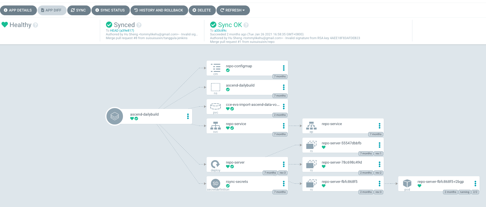
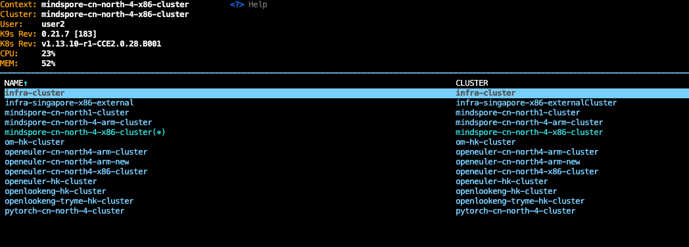

# 应用上线介绍💻
当前基础设施维护了openEuler，openGauss，openLooKeng，MindSpore, Ascend等5个社区的基础设施服务，同时也支持社区开发者上线自己的服务，提供给社区。  
社区的基础设施是基于华为云Kubernetes服务的，因为如果想上线社区服务，第一步便是将现有的服务容器化,包括:
## 服务的容器化改造
针对现有服务的容器化改造，网上面有很多类似的指导文章，在这里我们仅列出一些常见的建议:
1. 参照单进程模型，对现有服务进行拆分，比如将数据库和应用拆分到独立的容器内。
2. 应用程序日志输出调整到标准输出，现有集群中已经包含ELK组件，标准输出的日志将会采集到ES后端，方便后续定位和统计。
3. 采用多阶段Dockerfile构建，保证构建环境的独立和干净，同时减少最终部署的镜像大小，提升部署时容器升级的速度。
4. 提供/healthz等接口，用于服务健康监测。
5. 敏感信息如数据库登录信息等，支持从环境变量中读取，方便生产环境部署时，集群通过秘钥直接注入。
6. 推荐使用[tini](https://github.com/krallin/tini)等组件作为容器1号进程，用于解决僵尸进程和信号响应的问题，更多可以移步[Tini advantage](https://github.com/krallin/tini/issues/8)
7. 不要使用root作为启动用户
8. 其他安全问题
::: warning
社区基础设施中已经包含RDS, Redis, MongoDB，ES等数据服务，真正部署时，推荐直接使用现有服务而不是基于对应镜像自行构建维护服务。
:::
## 服务部署Yaml
### 部署注意事项
1. 部署到集群中的服务默认具备外部网络访问的能力，能不能正常访问国外网络，取决于我们部署到的集群所在位置，比如openEuler-hk默认可以翻墙😀 , 你可以访问[集群介绍](#), 查看当前支持的集群以及所属社区。
2. 当前集群的网络入口统一为每个集群的Ingress实例，如果您需要暴露Web UI或者API，需要通过创建Ingress来使用，比如我们CLA服务的入口(涵API)资源定义如下:
```yaml
# ingress definition for cla web UI
apiVersion: extensions/v1beta1
kind: Ingress
metadata:
  annotations:
    kubernetes.io/ingress.class: nginx
    nginx.ingress.kubernetes.io/limit-connections: "400"
    nginx.ingress.kubernetes.io/limit-rps: "400"
    nginx.ingress.kubernetes.io/configuration-snippet: |
      add_header X-XSS-Protection "1; mode=block";
      add_header Strict-Transport-Security "max-age=31536000";
      add_header X-Frame-Options "SAMEORIGIN";
      add_header Content-Security-Policy "script-src 'self' *.baidu.com *.googleapis.com ers.baidu.com 'unsafe-eval' 'unsafe-inline';object-src 'none';frame-ancestors 'self'";
  name: cla-ingress
spec:
  tls:
    - hosts:
        - clasign.osinfra.cn
      secretName: tls-secrets
  rules:
    - host: clasign.osinfra.cn
      http:
        paths:
          - backend:
              serviceName: claservice
              servicePort: 80
            path: /
---
# Ingress definition for cla backend server
apiVersion: extensions/v1beta1
kind: Ingress
metadata:
  annotations:
    kubernetes.io/ingress.class: nginx
    nginx.ingress.kubernetes.io/rewrite-target: /$2
    nginx.ingress.kubernetes.io/proxy-body-size: 8m
  name: cla-ingress-backend
spec:
  tls:
    - hosts:
        - clasign.osinfra.cn
      secretName: tls-secrets
  rules:
    - host: clasign.osinfra.cn
      http:
        paths:
          - backend:
              serviceName: cla-backend-service
              servicePort: 80
            path: /api(/|$)(.*)
```
你需要在ingress中至少包含下面2个annotation:  
a. `kubernetes.io/ingress.class: nginx`: 表明ingress的后台处理controller指向nginx。  
b. `cert-manager.io/cluster-issuer: letsencrypt-issuer`: 自动申请域名对应证书。

3. 如果需要使用持久卷，需要查看每个集群中支持的Storage Class[列表](#)，基于SC名创建对应的PVC。
4. 由于我们部署的Yaml都放在公开库，所以密码等敏感信息会有问题，我们推荐使用secret definition的方式解决，具体你需要:  
    a. 联系管理员将秘钥配置到秘钥管理后端: https://secrets.osinfra.cn  
    b. 使用SecretDefinition文件，将秘钥同步到集群，并使用, 具体参考下面的样例:  
```yaml
apiVersion: secrets-manager.tuenti.io/v1alpha1
kind: SecretDefinition
metadata:
  name: purge-secrets
spec:
  name: purge-secrets
  keysMap:
    password:
      path: secrets/data/infra-common/nginx-purger
      key: password
    username:
      path: secrets/data/infra-common/nginx-purger
      key: username
```
上面的资源会将后端`secrets/data/infra-common/nginx-purger`路径下的username和password字段同步到当前集群中，并创建对应的secret: `purge-secrets`
### 选择部署的路径
当前社区的基础设施部署代码是按照社区区分的，
1. [openEuler社区](https://github.com/opensourceways/infra-openeuler)
2. [openGauss社区](https://github.com/opensourceways/infra-opengauss)
3. [MindSpore社区](https://github.com/opensourceways/infra-mindspore)
4. [openLookeng社区](https://github.com/opensourceways/infra-openlookeng)
5. [通用基础设施服务](https://github.com/opensourceways/infra-common)    
如果只是提供给某个社区使用，推荐直接部署到对应社区部署仓库，否则统一放在infra-common的代码仓库，每个代码仓库的结构如下:
```shell
infra-openeuler git:(master) tree -L 2
.
|-- applications
|   |-- api-ingress
|   |-- ssh-tunnel
|   |-- ssh-tunnel-cn-north4
|   |-- ssh-tunnel-cn-north4-2
|   `-- sync-bot
|-- LICENSE
`-- README.md
```
比如，当需要往openEuler社区部署新的服务，在applications下创建对应的服务目录，并归档yaml即可，我们以微信小程序的后台服务为例:
```shell
➜  meeting-server git:(master) tree -L 2
.
|-- cronjob.yaml
|-- deployment.yaml
|-- kustomization.yaml
|-- namespace.yaml
|-- pvc.yaml
|-- secrets.yaml
`-- service.yaml
```
这里面,我们建议使用kustomize工具对所有的资源文件进行整合和管理, 比如:
```yaml
resources:
- namespace.yaml
- deployment.yaml
- service.yaml
- secrets.yaml
- cronjob.yaml
- pvc.yaml
commonLabels:
  app: meetingserver
  community: openeuler
apiVersion: kustomize.config.k8s.io/v1beta1
kind: Kustomization
namespace: meetingserver
images:
- name: swr.ap-southeast-1.myhuaweicloud.com/opensourceway/app-meeting-server
  newTag: ab625e52fe3b93d4fcf951e7eef8d4f08f556298
```
其中我们定义的`commonLabels`方便后续我们再Kibanan上面基于Label对Pod进行快速过滤和查询。
### 提交应用部署文件
当上面的应用部署代码提交到对应的社区仓库后，您就可以上线你的服务了，我们上线服务的流程也是基于代码仓库的，这里你需要提交一个Kubernetes的自定义资源`Argocd Application`到我们指定的仓库[infra-community](https://github.com/opensourceways/infra-common)
```yaml
apiVersion: argoproj.io/v1alpha1
kind: Application
metadata:
  name: openeuler-hk-meetingserver
  namespace: argocd
  labels:
    community: openeuler-hk
spec:
  destination:
    namespace: meetingserver
    name: openeuler-external
  project: openeuler
  source:
    path: applications/meeting-server
    repoURL: https://github.com/opensourceways/infra-openeuler.git
    targetRevision: HEAD
  syncPolicy:
    automated:
      prune: false
```
其中比较关键的字段定义如下:
1. metadata.name: 应用名，需要保证全局唯一，所以可以使用community-region-application的方式命名
2. labels.community: 引用所属的社区，方便后续统计和分类。
3. spec.destination.namespace: 应用部署到的集群对应的namespace
4. spec.destination.name: 应用部署到的集群名，完整的集群列表可以[参考])(#)
5. project: 项目名，跟社区名保持一致。
6. source.(path&repoURL&targetRevision): 服务要同步的Yaml路径，即上一步提交的仓库地址+文件夹路径
7. syncPolicy: 同步策略，你可以选择自动同步或者手动触发，自动同步在监测到source文件更新后，会自动触发集群应用更新。  

你需要以应用程序程序名命名，并存放到对应的社区目录中, 下图是mindspore社区上线的服务, 提交后应用会自动创建成功
```shell
➜  infra-community git:(master) tree -L 3
.
├── LICENSE
├── README.md
├── communities
│         ├── mindspore
│         │         ├── api-ingress-cn-north4.yaml
│         │         ├── arm-slave.yaml
│         │         ├── bot.yaml
│         │         ├── download-repo-cn-north4.yaml
│         │         ├── hk-x86-slave.yaml
│         │         ├── jenkins-cn-north4.yaml
│         │         ├── jenkins.yaml
```
## 上线后自助服务
### 手动同步应用
创建成功后的应用可以在我们的Web服务中直接查看应用的状态，通过我们的开发者账号登录地址`https://build.osinfra.cn`，可以查看服务的具体状态，包括
同步状态与时间，Kubernetes各个资源的状态，Pod的状态与日志等信息，加入你刚提交了Yaml文件的更新，你也可以在界面触发应用资源的更新，
下图展示的是`ascend-dailybuild`应用的状态。

### 搭建发布流水线
当前基础设施团队基于Jenkins提供服务的持续发布能力，您可以通过开发者账号登录地址:`https://jenkins.osinfra.cn/`配置并部署您应用的构建发布流水线，
一个最基本的流水线会包括:
1. 测试验证
2. 构建服务镜像
3. 推送镜像到华为云SWR
4. Clone部署代码，并通过kustomize edit修改Yaml中的镜像ID
5. 提交修改
6. 触发ArgoCD升级，或者自动触发

::: tip
当前基础设施的Jenkins中已经包含华为云SWR的账号信息，如果你需要使用，需要配置Env Binding，
将HuaweiCloud SWR Token映射为`DOCKER_USER`与`DOCKER_PASS`， 并在上传前执行docker login指令，其次镜像名需要带前缀:
`swr.ap-southeast-1.myhuaweicloud.com/opensourceway/{image_name:image_tag}`
:::
如果需要触发ArgoCD更新应用，需要使用ArgoCD的API，参考如下:
```shell
ARGOCD_TOKEN=`curl -X POST -s -d '{"password":"'${ARGOCD_PASS}'","username":"'${ARGOCD_USER}'"}' "https://build.osinfra.cn/api/v1/session"|tail -1 |awk -F '[""]' '{print$4}'`>/dev/null
curl -X POST -s -o /dev/null --cookie "argocd.token=${ARGOCD_TOKEN}" "https://build.osinfra.cn/api/v1/applications/${PROJECT_NAME}/sync">/dev/null
```
### 查看容器日志
容器日志是临时的，重启后会导致之前的日志失效，为此，基础设施提供了Kibana看板，帮助查看和搜索现有的容器日志, 你可以直接访问地址[kibana](https://kibana.osinfra.cn/app/kibana)浏览。
::: warning
当前网站登录需要用户名和密码信息，您可以联系我们管理员获取密码信息
:::
在Discover的页面，您需要选择`logstash*` pattern，在过滤条件里面你需要基于应用名称容器标签等kubernetes属性对日志进行过滤，举个例子，假如我需要查看openEuler社区会议小程序后台服务的日志，我可以基于下面的条件进行过滤:
```shell
kubernetes.labels.app == openeuler-meetingserver #选择openEuler社区的会议程序app
kubernetes.labels.component == web-server #选择小程序中组件为web-server的容器
```
所以我们推荐在部署您的应用的时候，需要基于业务逻辑合理的规划您的kubernets资源标签， 当然你也可以基于其他条件进行过滤，我们拿一个实际的日志Json样例，帮助你简单了解目前收集到的字段:
```json
{
  "_index": "logstash-2021.03.27",
  "_type": "_doc",
  "_id": "4nW8cngBgtBrXQC23980",
  "_version": 1,
  "_score": null,
  "_source": {
    "log": "[pid: 16|app: 0|req: 3148/15742] 172.17.0.193 () {58 vars in 1255 bytes} [Sat Mar 27 16:11:17 2021] GET /meetingsdata/?rnd=0.5434837174794194 => generated 135155 bytes in 679 msecs (HTTP/1.1 200) 5 headers in 153 bytes (1 switches on core 0)\n",
    "stream": "stderr",
    "docker": {
      "container_id": "a666a6e3bf229b2e03af9f1a2a70ee5f94e061ca371ae11f4c48826a0f0030f7"
    },
    "kubernetes": {
      "container_name": "meeting-server",
      "namespace_name": "meetingserver",
      "pod_name": "meeting-server-68d65b4d44-s2s7f",
      "container_image": "swr.ap-southeast-1.myhuaweicloud.com/opensourceway/app-meeting-server:ab625e52fe3b93d4fcf951e7eef8d4f08f556298",
      "container_image_id": "docker-pullable://swr.ap-southeast-1.myhuaweicloud.com/opensourceway/app-meeting-server@sha256:c27764e84a4a126629020a36dbb95227c487125c031d6707ba59022c9a8330f8",
      "pod_id": "7bd943c6-87bb-11eb-820a-fa163eb8d9d5",
      "host": "172.16.1.30",
      "labels": {
        "app": "openeuler-meetingserver",
        "component": "web-server",
        "pod-template-hash": "68d65b4d44"
      },
      "master_url": "https://10.247.0.1:443/api",
      "namespace_id": "63b93778-e6a1-11ea-820a-fa163eb8d9d5",
      "namespace_labels": {
        "app": "openeuler-meetingserver",
        "name": "meetingserver",
        "app_kubernetes_io/instance": "openeuler-hk-meetingserver"
      }
    },
    "@timestamp": "2021-03-27T08:11:18.306347184+00:00",
    "tag": "kubernetes.var.log.containers.meeting-server-68d65b4d44-s2s7f_meetingserver_meeting-server-a666a6e3bf229b2e03af9f1a2a70ee5f94e061ca371ae11f4c48826a0f0030f7.log"
  },
  "fields": {
    "@timestamp": [
      "2021-03-27T08:11:18.306Z"
    ]
  },
  "highlight": {
    "kubernetes.labels.component": [
      "@kibana-highlighted-field@web@/kibana-highlighted-field@-@kibana-highlighted-field@server@/kibana-highlighted-field@"
    ],
    "kubernetes.labels.app": [
      "@kibana-highlighted-field@openeuler@/kibana-highlighted-field@-@kibana-highlighted-field@meetingserver@/kibana-highlighted-field@"
    ]
  },
  "sort": [
    1616832678306
  ]
}
```
### 登录集群Console
您也可以直接登录我们的在线kubernetes管理平台，进行应用的查看，调试，管理平台包含了我们所有的集群和服务信息，也会跟随新的集群加入不断刷新，具体访问地址[k9s](https://operate.osinfra.cn/),
访问前，您需要首先申请开发者权限，即申请加入我们的[Github Team](https://github.com/orgs/opensourceways/teams/developer)，因为安全的原因，目前开放的还是只读权限。


## 后记
如果您有任何问题和改进建议，欢迎您随时联系[github issue](https://github.com/opensourceways/infra-landscape/issues)
